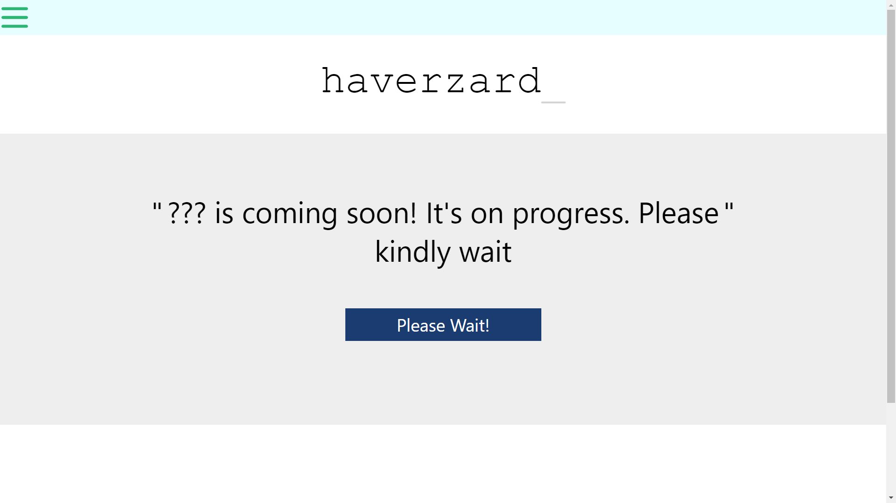
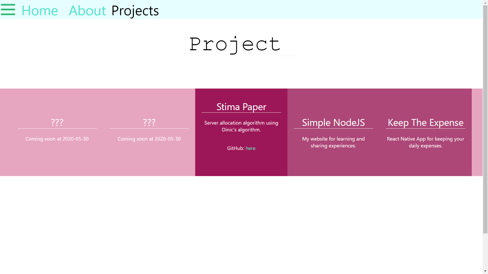

# haverzard web frontend
## Description
Haverzard website front-end using Svelte Framework.

## Prerequisites
- Node.js
- Node Package Manager (npm)

## Installation
```npm install```

## Run
```npm start```

## View

